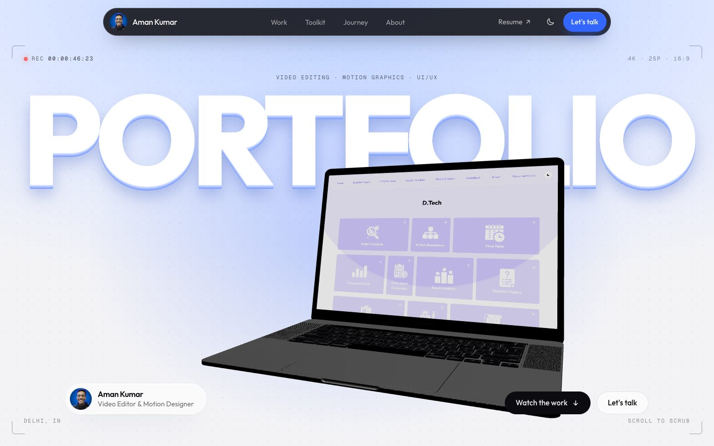
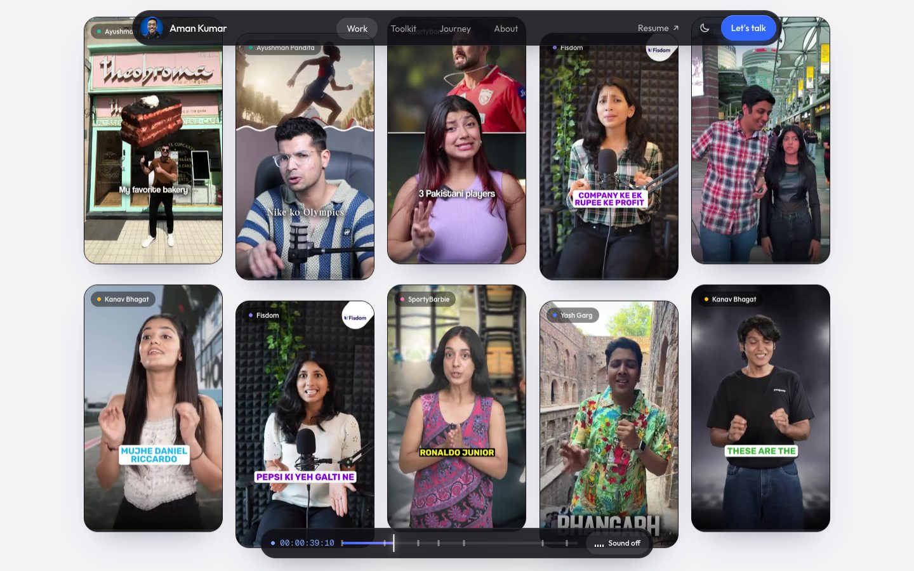
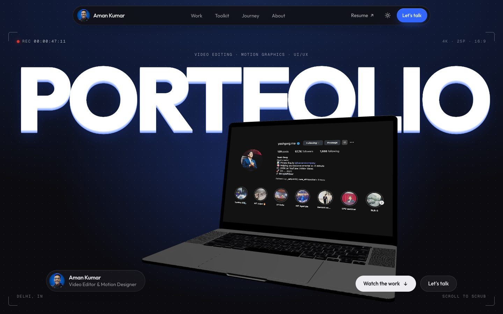
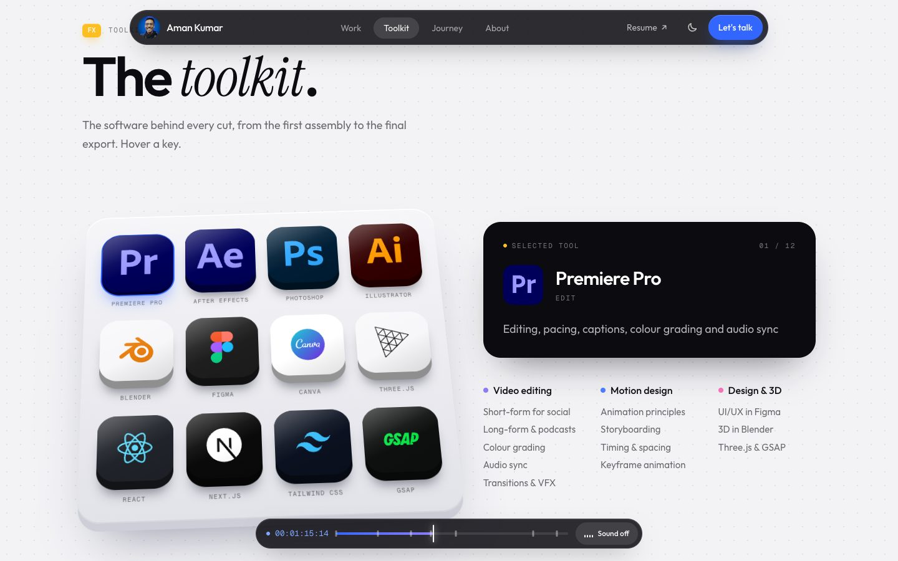
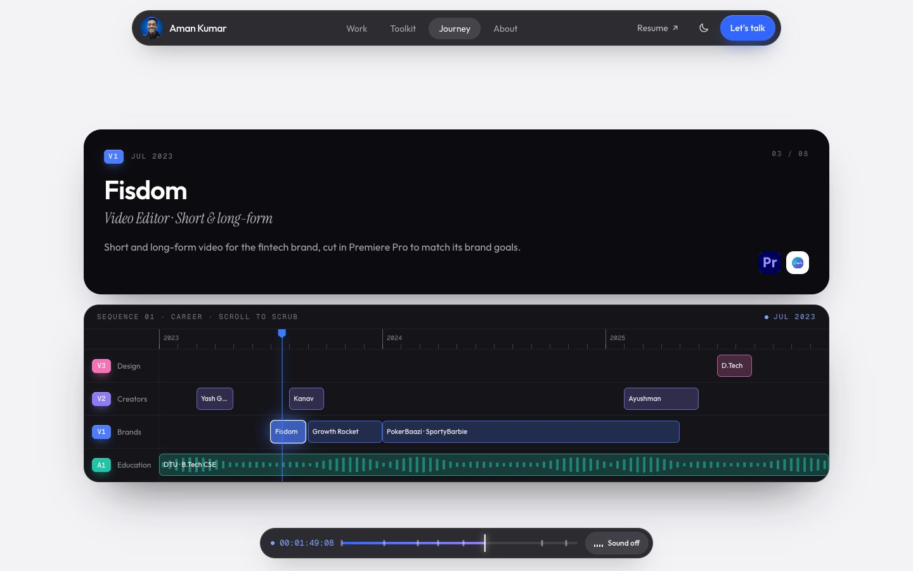
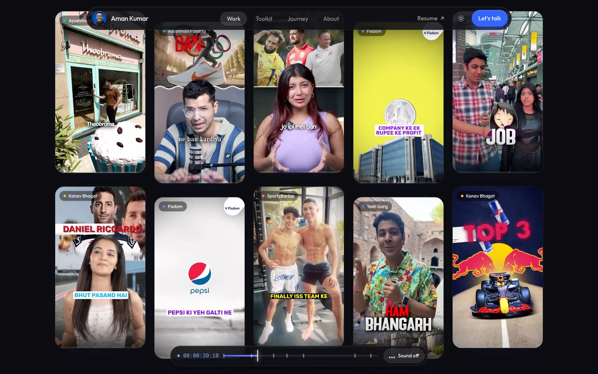

<div align="center">

# Aman Kumar: Video Editor & Motion Designer

A portfolio built like an editing timeline: autoplaying short-form reels, long-form YouTube edits, a software toolkit, and a career sequence you scrub by scrolling. Light and dark themes, with 3D scenes in React Three Fiber.

**[Live site](https://portfolio-aman-xi.vercel.app/)**




</div>

> **Note**: The 3D model of Delhi Technological University (DTU) used here is an original creation by me (Aman Kumar) and is **not open for reuse or redistribution**. The reels and videos belong to the brands and creators they were made for.

---

## Features

- **Short-form**: a grid of 9:16 reels that autoplay muted while on screen. Hovering shows a Sound button. Once sound is on, hovering any reel plays its audio (one at a time), and clicking opens the full video with controls. Filter by client.
- **Long-form**: YouTube edits as muted looping previews, opened in a full-size player.
- **Toolkit**: a 3D keyboard of 12 software keycaps (Premiere Pro, After Effects, Photoshop, Illustrator, Blender, Figma, Canva, Three.js, React, Next.js, Tailwind, GSAP).
- **Journey**: a Premiere-style timeline with tracks and clips. The playhead moves as you scroll and the details change clip by clip.
- **Interactive throughout**: a viewfinder hero with a live REC timecode, scroll-driven text and stats, a bottom transport bar (timecode, section markers, sound toggle, press `M`), and a URL `#hash` that follows the section you're in.
- **Light and dark themes**: a toggle in the navbar, saved between visits, following the device setting until you choose.
- **3D scenes**: an animated laptop in the hero and the DTU front gate in About. Both render only while on screen.
- **Responsive and accessible**: works down to 320px wide, respects reduced-motion settings, keyboard-friendly.

<div align="center">




</div>

---

## Tech stack

- **React 19** with **Vite**
- **Tailwind CSS 4**
- **Three.js** via `@react-three/fiber` and `@react-three/drei` for the 3D scenes
- **GSAP** (`ScrollTrigger`) for scroll-driven motion
- **Deployment**: [Vercel](https://vercel.com)

---

## Run it locally

```bash
npm install
npm run dev        # http://localhost:5173
npm run build      # production build in dist/
npm run preview    # serve the production build
```

---

## Editing the content

Almost everything you'd change lives in `src/data/`:

| File | What it controls |
|---|---|
| `src/data/work.js` | Short-form reels, long-form YouTube videos, client list, stats, contact details and social links |
| `src/data/toolkit.js` | The keyboard tools and the skill groups beside it |
| `src/data/journey.js` | The career timeline clips |

### Adding a short-form reel

1. Export the reel as H.264 MP4, about 720×1280 at 3–5 Mbps.
2. Drop it in `src/assets/videos/short/`, for example `nike-launch.mp4`. It appears in the grid automatically.
3. Optionally add an entry to `shortForm` in `src/data/work.js` with the same `id` to set its client, title, date and Instagram link.
4. Optional extras: a poster image (`nike-launch.jpg`) and a lighter grid copy (`nike-launch.preview.mp4`, about 480×854 at 800 kbps).

See [`src/assets/videos/README.md`](src/assets/videos/README.md) for naming rules and export settings. Keep each file under 100 MB, since GitHub rejects larger ones. For full-length videos, use YouTube instead.

### Adding a long-form video

Add its YouTube id to `longForm` in `src/data/work.js`.

### Changing the look

- Colors, the dark theme and shared styles are in `src/index.css` (the `@theme` block and the `[data-theme="dark"]` block).
- The Premiere timeline behind the short-form heading is drawn by `src/components/TimelineBackdrop.jsx`. Its strength is the `opacity-75` class in `src/sections/ShortForm.jsx`.

---

## Project structure

```
src/
  sections/     Hero, Intro, ShortForm, LongForm, Toolkit, Journey, Design, About, Navbar, Footer
  components/   3D scenes, video tiles and player (media/), keycap logos, transport bar, icons
  data/         Editable content (work, toolkit, journey)
  hooks/        useInView, useTheme
  lib/          Scroll and observer helpers, timecode formatting, video file lookup
  assets/videos/  Reels dropped in here are picked up automatically
public/
  models/       3D models (laptop, DTU campus)
  assets/       Images and the hero laptop's screen video
```

---

## Previous versions

The earlier design is preserved on the [`v1`](../../tree/v1) branch. The current site is on `main` and `v2`.
